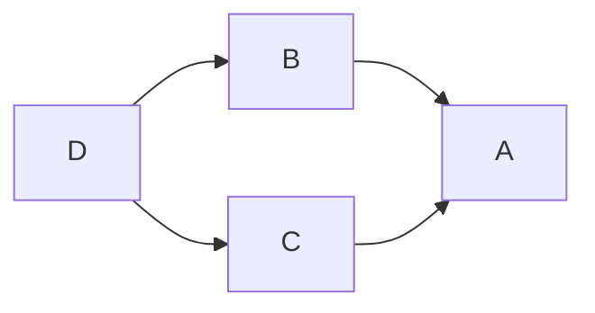

# Status

📜 Proposed 2023-05-15

# Context

In a project with multiple packages, in order to provide stable and reproducible builds, there is a need to
control version bounds of the dependencies used.
This is done by entering version bounds into the `.cabal` file, like described in [Cabal documentation](https://cabal.readthedocs.io/en/latest/cabal-package.html#pkg-field-build-depends).
Let's consider an example where multiple package *components* (e.g. libraries, internal libraries, test-suites,
executables) form a more complex dependency graphs like the following one:

Considering an example case, where `B` and `C` but not `A`, have the same dependencies, we need to encode version ranges twice.
This results in duplicated entries in `.cabal` file, with duplicated version bounds.

## Considered options

1. **Using explicit common stanzas, one per dependency.** See for example: https://github.com/input-output-hk/hedgehog-extras/blob/e7f3c9ff967ed6f3b4c8c17013a4e0c2f541e053/hedgehog-extras.cabal#L19
    * **Advantages**
      * Fine grained control over what dependency is included where, with the single place which defines
        version bounds.
    * **Disadvantages**
      * A lot of boilerplate when defining new dependencies.

1. **Moving common dependencies to `common` stanzas, multiple dependencies in one stanza**.
  This allows for grouping of dependencies between components in order specify version bound only once.
  For example the same `common` stanza could be reused in `B` and `C` in order to define version bounds in a
  single place.
    * **Advantages**
      * Grouping multiple dependencies together introduces less boilerplate in comparison to the
        *one-stanza-per-one-dependency* option.
    * **Disadvantages**
      * It may be hard to define logical grouping for few unrelated dependencies.
      * In the worst case scenario we'll end up with *one-stanza-per-one-dependency* definition of
        dependencies, when those will be used in different components.
      * Each common stanza will need to be named.
        There is a risk the naming will be inconsistent between projects and confusion could occur around that inconsistency and bike-shedding may result from having to deal with those inconsistencies.

1. **Declaring dependencies' bounds everywhere**.
  In the provided example, the version bounds of common dependencies of `A` and `B` should be both defined in
  `A` and `B`.
    * **Advantages**
      * Makes it easy to remember how to update dependency version everywhere.
    * **Disadvantages**
      * It's not hard to overlook one spot when a person updating dependency version is unfamiliar with the
        rule.

1. **Declaring dependencies' bounds once, as close as possible to the dependency tree root.**
  In the provided example, the version bounds of common dependencies of `A` and `B` should be only defined in
  `A`.
  If dependencies are both present in `B` & `C`, the version bounds should be duplicated in both components.
    * **Advantages**
      * Slight de-duplication of version bounds definitions in comparison to duplicated version bounds
      * Does not require introducing `common` stanzas
    * **Disadvantages**
      * In the `B` & `C` case, there will be a duplication of version bounds.
      * Inconsistency in version bounds declaration because of `B` & `C` case.
      * If there are multiple roots then, then require all those roots would have to have bounds.
        If one is accidentally missed, it is possible for those bounds to be ignored if only roots without bounds are in the cabal plan, which could lead to the wrong version of the package build built.

1. **Using a configuration language allowing to generate cabal files** like https://github.com/dhall-lang/dhall-to-cabal .
  This way instead of modifying cabal files, one would has to modify configuration file and then regenerate
  `.cabal` files from those.
    * **Advantages**
      * Very flexible way of configuration, allows for deduplication of cabal files' contents.
    * **Disadvantages**
      * New development tool with non-zero learning effort required for team members.
      * Additional piece requiring integration in CI.
      * Syntax usually is more verbose than just `.cabal` files itself.
      * If the cabal file is checked in to git, then PRs are larger because there will be changes in both the alternate file and the cabal file itself.
        If the cabal file is not checked into git then tools we rely on may not work on the repository. (For example cardano-haskell-packages and source-repository-package stanzas)

## Status quo

Currently is used a mixture of options 2, 3 and 4.
Most frequently is used an option 3 for libraries maintained by IOG, but also not everywhere.

# Decision

TBD

# Consequences

The adopted version constraints setting policy should be used in `cardano-node`, `cardano-api` and `cardano-cli` projects.
This will allow for less error-prone dependency management.

# References

1. https://cabal.readthedocs.io/en/latest/cabal-package.html#pkg-field-build-depends
1. [Per-cabal-file `constraints` - Issue in haskell/cabal](https://github.com/haskell/cabal/issues/8912)
1. https://input-output-hk.github.io/cardano-engineering-handbook/policy/haskell/packaging/versioning.html

