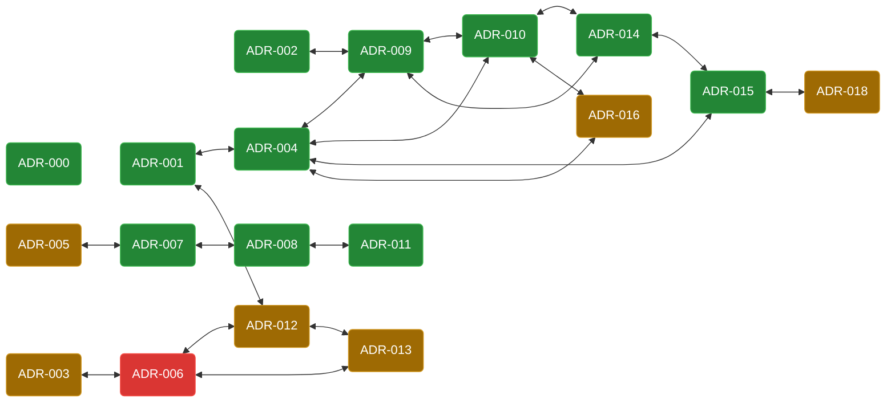

## ADR Relationship Graph

## ADR Index

* ✅ [[ADR-0 Documenting Architecture Decisions]]
* ✅ [[ADR-1 Default eras for CLI commands]]
* ✅ [[ADR-2 Module structure for generators]]
* 📜 [[ADR-3 Dependencies version constraints in cabal file]]
* ✅ [[ADR-4 Support-only-for-mainnet-and-upcoming-eras]]
* 📜 [[ADR-5 cardano-testnet-node-configuration-file]]
* ❌ [[ADR-6 Using optparse-applicative main repository]]
* ✅ [[ADR-7 CLI Output Presentation]]
* ✅ [[ADR-8 Use RIO in cardano-cli]]
* ✅ [[ADR-9 cardano-api exports convention]]
* ✅ [[ADR-10 cardano-api script witness API]]
* ✅ [[ADR-11 Better call stacks of IO exceptions]]
* 📜 [[ADR-12 Standardise CLI multiple choice flags construction]]
* 📜 [[ADR-13 Metavars must follow screaming snake case]]
* ✅ [[ADR-14 Total conversion functions conventions]]
* ✅ [[ADR-15 JavaScript API for Cardano via WASM-compiled cardano-api]]
* 📜 [[ADR-16 cardano-api new TxBodyContent]]
* 📜 [[ADR-18 gRPC Server for Cardano Node (cardano-rpc)]]

## Legend

* 📜 Proposed
* ✅ Adopted
* ❌ Rejected
* 🗑️ Deprecated
* ⬆️ Superseded

